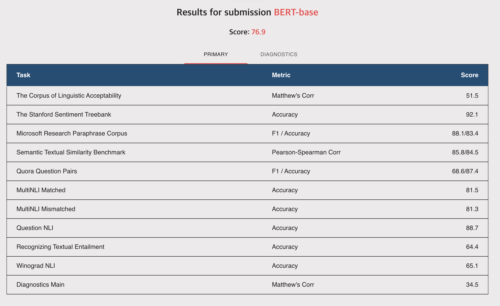

# GLUE Benchmark

GLUE is a benchmark dataset for evaluating the performance of models for natural language understanding.

## Dataset

The dataset is available at [https://gluebenchmark.com/](https://gluebenchmark.com/), and Hugging Face provides a convenient wrapper at [https://huggingface.co/datasets/glue](https://huggingface.co/datasets/glue).

## Result

We use the 'bert-base-cased' model from Hugging Face to evaluate the performance upon the GLUE Benchmark.

### Validation Set

For STS-B Task, we report Pearson / Spearman correlation. For the other tasks, we report accuracy / F1 score.

| Model | CoLA | SST-2 | MRPC | STS-B | QQP | MNLI-M | MNLI-MM | QNLI | RTE | WNLI |
| --- | --- | --- | --- | --- | --- | --- | --- | --- | --- | --- |
| BERT | 83.52/78.29 | 91.52/91.26 | 87.18/84.54 | 89.25/88.7 | 89.31/88.23 | 81.73/80.89 | 82.26/81.45 | 89.75/89.42 | 67.48/66.59 | 56.55/36.1

### Test Set - Benchmark

