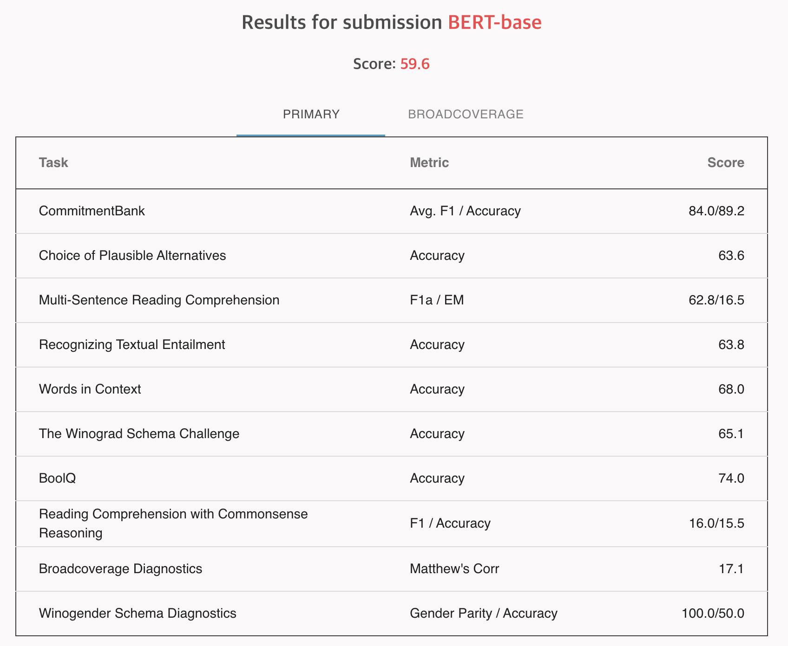

# SuperGLUE Benchmark

SuperGLUE is a sticker version of GLUE, which is a benchmark dataset for evaluating the performance of models for natural language understanding.

## Dataset

The dataset is available at [https://super.gluebenchmark.com/](https://super.gluebenchmark.com/), and Hugging Face provides a convenient wrapper at [https://huggingface.co/datasets/super_glue](https://huggingface.co/datasets/super_glue).

## Result

## Reference

- https://github.com/nyu-mll/jiant/blob/daa5a258e3af5e7503288de8401429eaf3f58e13/jiant/proj/main/modeling/taskmodels.py#L17
- https://github.com/nyu-mll/jiant/blob/daa5a258e3af5e7503288de8401429eaf3f58e13/jiant/proj/main/modeling/heads.py#L120
- https://github.com/nyu-mll/jiant/blob/daa5a258e3af5e7503288de8401429eaf3f58e13/jiant/tasks/lib/wic.py
- https://github.com/nyu-mll/jiant/blob/daa5a258e3af5e7503288de8401429eaf3f58e13/jiant/ext/allennlp.py#L9